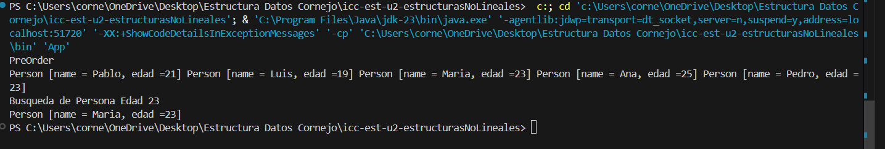
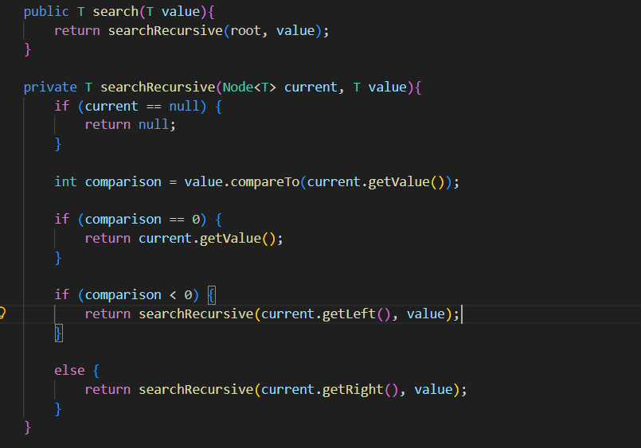
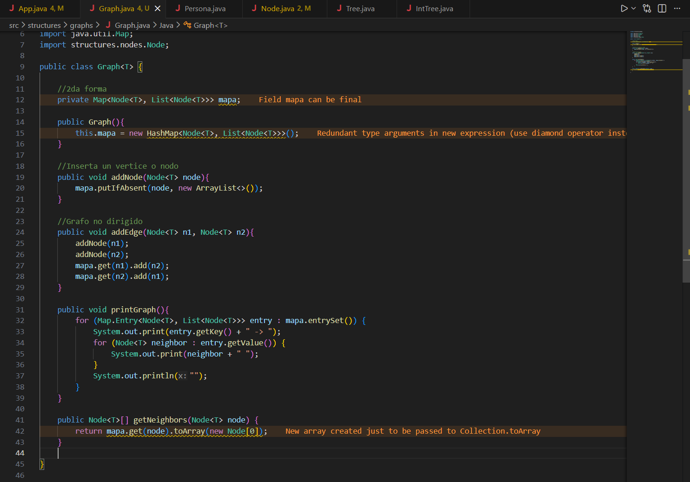
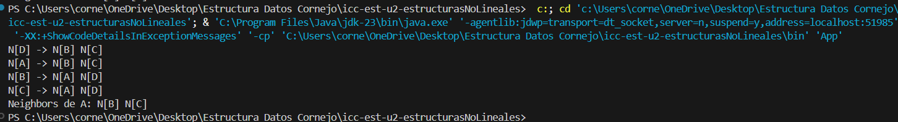

# Práctica: Estructuras No Lineales - 

## Autor
- Nombre: Nicolás Cornejo
- Carrera/Curso: Computacion - Estructura de Datos

##  Nombre de la práctica - Fecha
- Práctica: Práctica de Árboles – Implementación Integers
- Fecha: [2026-01-05]

- Práctica: Práctica de Árboles – Interface Comparable
- Fecha: [2026-01-06]

- Práctica: Práctica de Grafos – Lista de Adyacencia y Vecinos
- Fecha: [2026-01-08]

## Descripción
Se desarrolló la estructura de un Árbol Binario, organizando el proyecto en paquetes para mantener ordenado el código. Se implementó una versión para enteros utilizando lógica recursiva tanto para insertar los datos como para realizar los recorridos PreOrder, InOrder, PostOrder.

Se desarrolló un Árbol Binario genérico implementando la interfaz `Comparable` para permitir el ordenamiento dinámico de objetos complejos (clase `Persona`). Se codificaron algoritmos recursivos para la inserción. Además, se implementaron dos estrategias de búsqueda.

Se implementó la funcionalidad básica de un Grafo utilizando Map. Se codificaron los métodos de visualización `printGraph` y se desarrolló el método `getNeighbors`.

## Evidencias
### Captura 1
Inserta aquí la captura del código o de la ejecución.
- Archivo: 

### Captura 2 
Inserta aquí una segunda captura si aplica.
- Archivo: 

### Captura 3
- Archivo: 

### Captura 4
- Archivo: 

### Captura 5
- Archivo: 

### Captura 6
- Archivo: 

