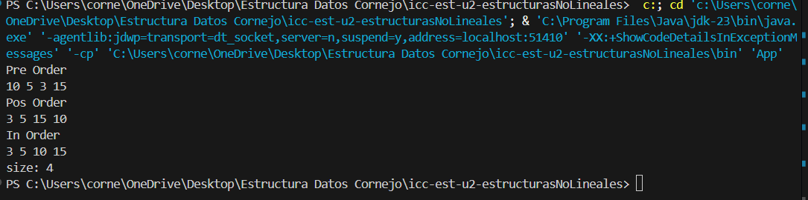
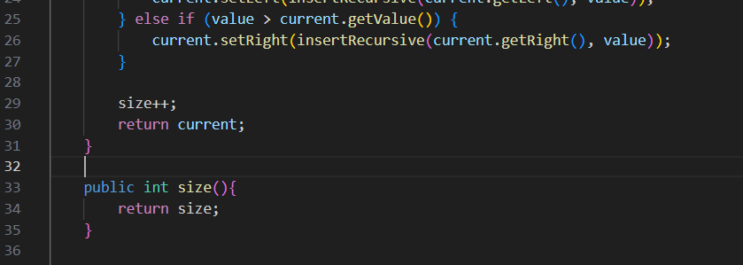

# Práctica: Estructuras No Lineales - 

## Autor
- Nombre: Nicolás Cornejo
- Carrera/Curso: Computacion - Estructura de Datos

##  Nombre de la práctica - Fecha
- Práctica: Práctica de Árboles – Implementación Integers
- Fecha: [2026-01-05]

## Descripción
Se desarrolló la estructura de un Árbol Binario, organizando el proyecto en paquetes para mantener ordenado el código. Se implementó una versión para enteros utilizando lógica recursiva tanto para insertar los datos como para realizar los recorridos PreOrder, InOrder, PostOrder.

## Evidencias
### Captura 1
Inserta aquí la captura del código o de la ejecución.
- Archivo: 

### Captura 2 
Inserta aquí una segunda captura si aplica.
- Archivo: 

